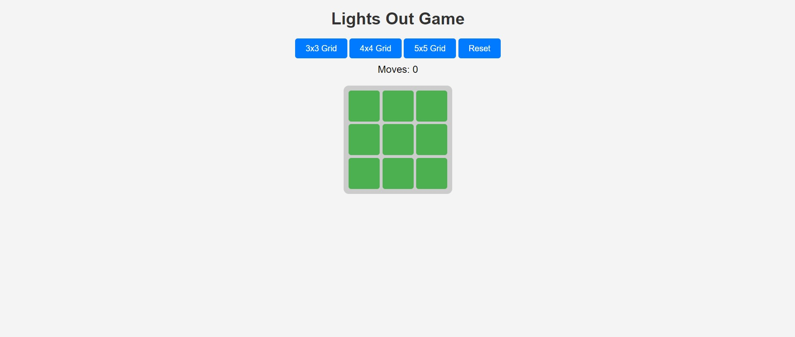
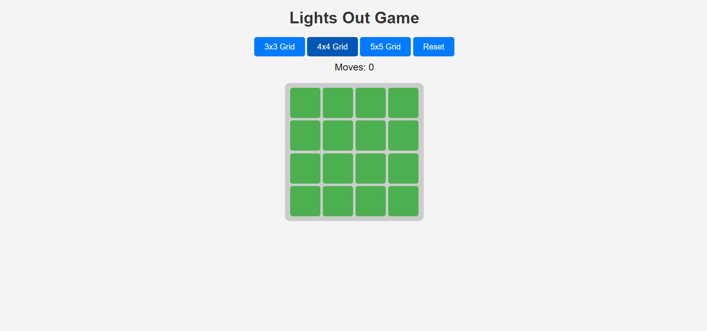
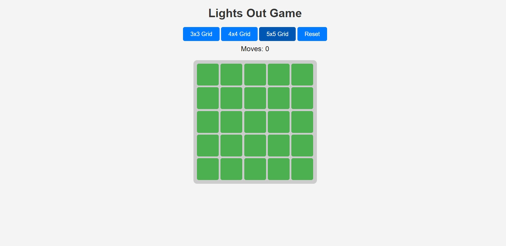

# Lights Out Game 🎮

A simple yet fun **Lights Out Game** built using HTML, CSS, JavaScript, and jQuery. The goal is to turn off all the lights on the grid. Clicking on a cell toggles that cell and its immediate neighbors. The challenge lies in achieving this with the minimum number of moves.

---

## 🔥 Features
- **Dynamic Grid Sizes**: Choose between **3x3**, **4x4**, or **5x5** grids.
- **Toggle Mechanism**: Clicking a button toggles its state and that of its immediate neighbors.
- **Win Condition**: Alerts when all the lights are turned off.
- **Move Counter**: Tracks the number of moves taken to solve the puzzle.
- **Reset Button**: Restart the game with the current grid size.

---

## 🎮 How to Play
1. Select a grid size (**3x3**, **4x4**, or **5x5**).
2. Click on any button in the grid to toggle it and its neighbours.
3. Aim to turn off all the lights (buttons turn black).
4. Track your progress with the move counter.
5. Use the **Reset** button to restart.

---

## 📂 Project Structure
```
LightsOut/
├── index.html       # HTML structure for the game
├── styles.css       # CSS for layout and styling
├── script.js        # JavaScript logic using jQuery
└── README.md        # Project documentation
```

---

## 🛠️ Technologies Used
- **HTML5**: For the structure of the game.
- **CSS3**: For styling and layout of the grid.
- **JavaScript**: For game logic and interactions.
- **jQuery**: For simplified DOM manipulation.

---

## 🚀 Getting Started

### Prerequisites
Make sure you have the following installed:
- A web browser (Chrome, Firefox, etc.)
- Basic text editor or IDE (e.g., VS Code)

### Installation
1. Clone this repository:
   ```bash
   git clone https://github.com/your-username/lights-out-game.git
   ```
2. Navigate to the project directory:
   ```bash
   cd lights-out-game
   ```
3. Open `index.html` in your browser to play the game!

---

## 🎨 Screenshots

### 3x3 Grid


### 4x4 Grid


### 5x5 Grid


---

## 📈 Future Enhancements
- Add a **timer** to track time taken to solve the puzzle.
- Implement a **randomised initial state** for more challenging gameplay.
- Add a **leaderboard** to display high scores (fewest moves or fastest time).
- Enhance UI/UX with animations and sound effects.

---

## 🙌 Contribution
Contributions are welcome! If you’d like to improve the game or add new features:
1. Fork the repository.
2. Create a feature branch:
   ```bash
   git checkout -b feature-name
   ```
3. Commit your changes:
   ```bash
   git commit -m "Add a new feature"
   ```
4. Push to your forked repository and submit a pull request.

---

## Author

**Srijan Paul**  
[GitHub Profile](https://github.com/paul-srijan)


## Connect with Me

Feel free to connect with me on my other platforms for updates, queries, or collaborations!


- **GitHub**: [paul-srijan](https://github.com/paul-srijan)
- **LinkedIn**: [Srijan Paul](https://www.linkedin.com/in/srijan-paul-547354260/)
- **Email**: iampaulsrijan@gmail.com
- **twitter**: [Paul Srijan](https://x.com/iampaulsrijan)

---

## 🎉 Acknowledgements
Inspired by the classic **Lights Out** puzzle game. Special thanks to the open-source community for jQuery and other tools.

---

Enjoy the game! Feel free to fork and customise. If you have any questions or suggestions, open an issue or reach out. 😊